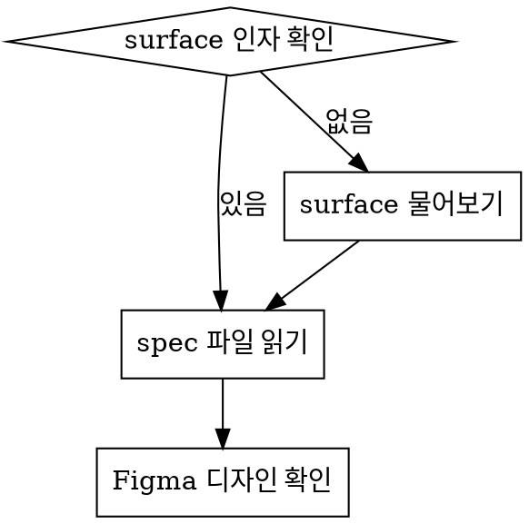

## Overview

Surface spec 문서를 읽고 체계적으로 TC 목록을 추출한다.
QA팀 표준 양식과 TC 생성 규칙(`references/tc-generation-rules.md`)을 따른다.

## Instructions

### Step 1: 스펙 수집



1. `references/surface-specs/{surface}.md` 읽기
2. `02. Project/{surface}/{surface}.md` (surface contract) 읽기
3. Figma 디자인 있으면 확인 (MCP 또는 로컬 export)

### Step 2: 화면 구성 파악

스펙을 읽고 **트리 형태**로 화면 구성을 정리한다. TC 추출 전 반드시 수행.

```markdown
{화면명}
├── {영역1} — 한 줄 설명
├── {영역2} — 한 줄 설명
│   ├── {하위 A} — 설명
│   └── {하위 B} — 설명
└── {영역3} — 설명
```

사용자에게 화면 구성을 보여주고 확인받은 뒤 Step 3로 진행.

### Step 3: TC 추출

각 구성 요소별로 다음 관점 체크:

| 관점 | 예시 |
|------|------|
| 초기 상태/기본값 | 메시지 없을 때 프로필 큰 표시 |
| 사용자 인터랙션 | 탭, 스와이프, 롱프레스 |
| 상태 전환 | on↔off, 선택↔미선택 |
| 조건 분기 | A이면 X, B이면 Y |
| 경계값 | 0개, 1개, 최대값 |
| 갱신/초기화 | 화면 진입/이탈, 백그라운드 |
| 다른 화면 연동 | 프로필 상세 이동, 위치 전송 |
| 에러 케이스 | 서버 통신 실패 |

**핵심 원칙:**
- 스펙에 명시된 동작만 TC로 만든다
- 하나의 TC = 하나의 검증 포인트
- UI 배치/존재 여부는 TC 아님 (동작→반응만)
- 포괄적 요약 문장은 TC 아님

### Step 4: TC 목록 작성

출력 포맷:

```markdown
# {surface} TC 목록

## 화면 구성
(Step 2 트리)

---

## {카테고리} ({N}개)

| # | TC | 스펙 근거 |
|---|-----|-----------|
| 1 | {사용자 동작} → {시스템 반응} | spec {섹션} |

---

## [추론] 에러 케이스 ({N}개)

| # | 추론 근거 | TC |
|---|-----------|-----|

---

## [기획자 확인 필요] UX 미확인 ({N}개)

| # | 스펙 원문 | 확인 필요 사항 |
|---|-----------|---------------|

---

**총 TC 수: 스펙 {N}개 + 추론 에러 {M}개 = {총합}개**
```

### Step 5: 크로스체크

화면 구성 트리의 모든 키워드가 TC에 반영되었는지 검증:

1. 트리 각 항목의 설명문에서 기능 키워드 추출
2. 각 키워드에 대응 TC가 최소 1개 있는지 확인
3. 누락 있으면 TC 추가

### Step 6: 저장

생성된 TC를 `02. Project/{surface}/QA/{surface}-tc.md`에 저장한다.

## 상세 규칙 참조

전체 TC 생성 규칙은 `references/tc-generation-rules.md` 참조:
- 입력/설정 화면 TC 분리 원칙
- UI 트리거 추론 3단계
- 연쇄 동작 분리
- 화면 외 정책 분리
- 에러 케이스 추론

QA 이슈 양식은 `references/qa-templates.md` 참조.
